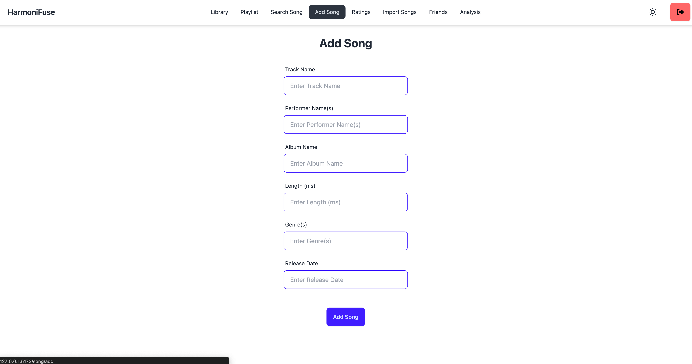
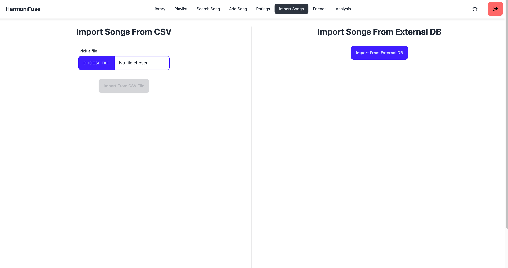

# HarmoniFuse - CS308 Project

HarmoniFuse is a music application that empowers users to curate their musical journey with a plethora of features. Users can seamlessly add their favorite songs, assign ratings, and receive personalized recommendations and in-depth analyses tailored to their music preferences and activities. The application goes beyond the ordinary by offering features such as the ability to effortlessly create playlists, connect with friends, and efficiently import/export song data.

## Authors

- TL: [@nkozdemir](https://github.com/nkozdemir)
- Backend: [@alpay-kilic](https://github.com/alpay-kilic)
- Mobile: [@ege2509](https://github.com/ege2509)

## Tech Stack

**Client:** React, TailwindCSS, DaisyUI

**Server:** Node.js, Express

**Mobile:** Android, Kotlin

## Run Locally

Clone the project

```bash
  git clone https://github.com/nkozdemir/CS308-Project-Frontend.git
```

Go to the project directory

```bash
  cd CS308-Project-Frontend
```

Install dependencies

```bash
  npm install
```

Start the server

```bash
  npm run dev
```

## Environment Variables

To run this project, you will need to add the following environment variables to your .env file

```
VITE_API_BASE_URL = "http://localhost:3000"
```

## Screenshots

- All screenshots can be accessed from [here](./images/).








